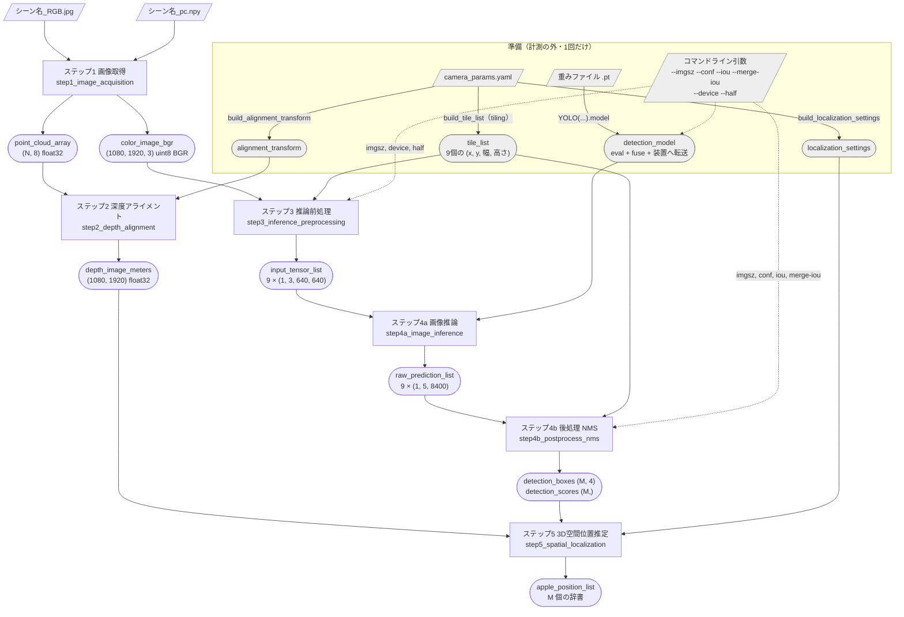
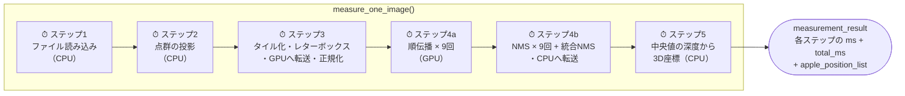
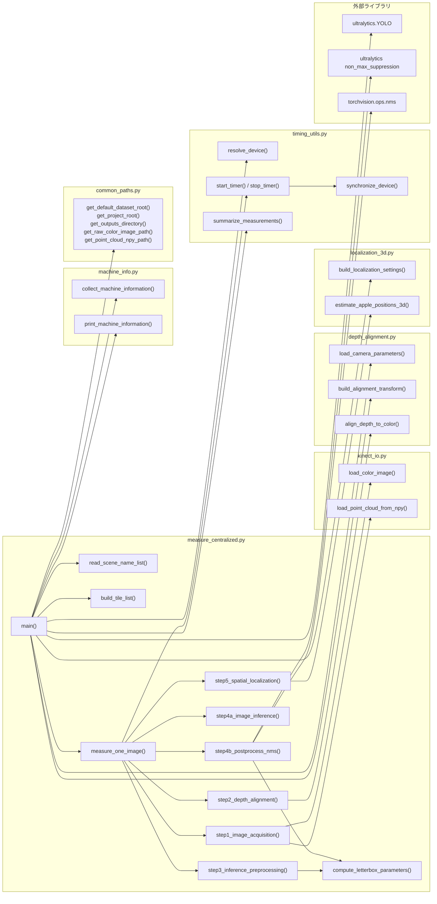
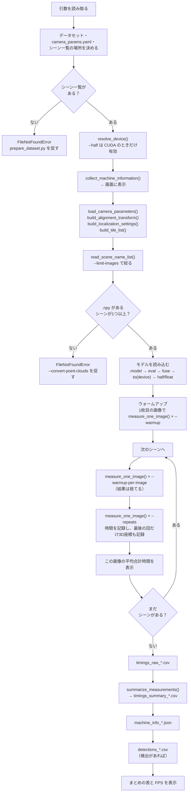

# `measure_centralized.py` の処理の依存関係

`src/measure_centralized.py` の各処理が、どのデータ・どの処理に依存しているかを
Mermaid 記法でまとめたものです。各処理の入力と出力の詳しい説明は
[README の「7. `measure_centralized.py` の処理の詳細」](../README.md#7-measure_centralizedpy-の処理の詳細)
を見てください。

## 1. データの流れ（ステップ間の依存関係）

1枚の画像を処理するとき（`measure_one_image()` の中）の、データの受け渡しです。
四角は処理、角の丸い四角はデータ、灰色は計測の外で1回だけ準備するものです。

**読み取れること**

- ステップ2（深度アライメント）は点群だけを使い、ステップ3〜4b（カラー画像の処理）とは
  **互いに依存しません**。2つの流れが合流するのはステップ5だけです。
  集中型計算方式ではこれを1台で順番に実行していますが、分散型にする場合は
  この2つの流れを別々の装置で同時に動かせます。
- `tile_list` はステップ3（切り出し）とステップ4b（座標を生画像に戻す）の両方で使います。
  2つのステップは `compute_letterbox_parameters()` を同じ引数で呼ぶので、
  座標の変換が必ず一致します。

## 2. 実行順序と時間の計測範囲

`measure_one_image()` の中では、データの依存関係とは関係なく、
ステップ1 → 2 → 3 → 4a → 4b → 5 の順に1つずつ実行し、
それぞれを `start_timer()` / `stop_timer()` で囲んで測ります。

⏱ の各処理の前後で `torch.cuda.synchronize()`（MPS では `torch.mps.synchronize()`）を
呼んでから時刻を取るので、GPU の非同期実行があってもステップの時間が正しく分かれます。
（「GPU」と書いたところは、GPU が使えない環境では CPU で動きます。）

## 3. 関数の呼び出し関係（モジュール間の依存）

## 4. `main()` 全体の流れ

