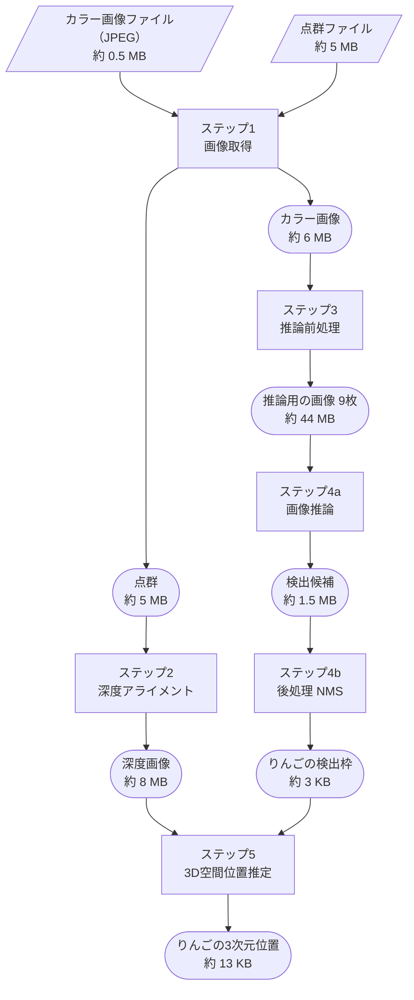
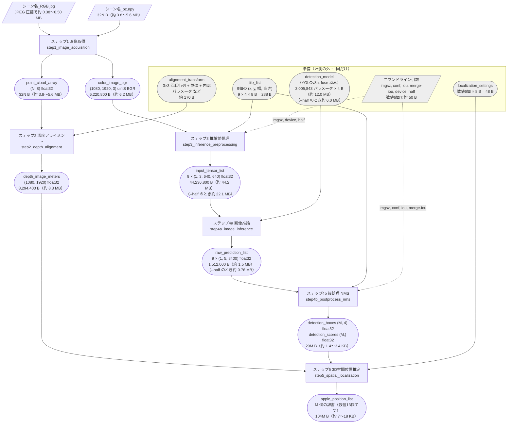
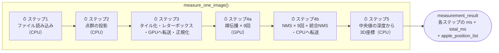
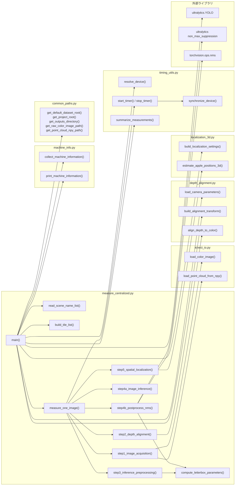
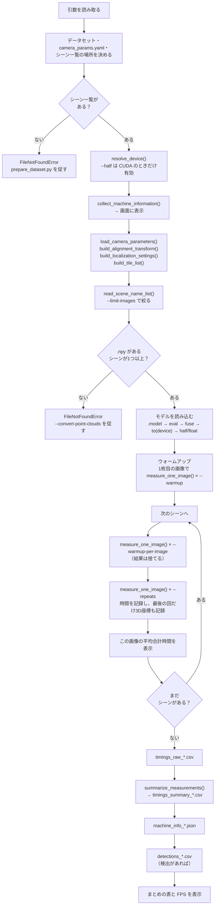

# `measure_centralized.py` の処理の依存関係

`src/measure_centralized.py` の各処理が、どのデータ・どの処理に依存しているかを
Mermaid 記法でまとめたものです。各処理の入力と出力の詳しい説明は
[README の「7. `measure_centralized.py` の処理の詳細」](../README.md#7-measure_centralizedpy-の処理の詳細)
を見てください。

## 1. データの流れ（発表用の簡略版）

次の節の図から、関数名・配列の形・準備の部分を省いたものです。
データ量は1枚の画像あたりのおおよその値で、点群の点の数と検出数は
手元のデータの中央値（点 約17万個、りんご 約130個）で計算しています。
ステップ4aの画像推論では、このほかに学習済みモデル（約 12 MB）を使います。

```mermaid
flowchart TD
    IMGFILE[/"カラー画像ファイル（JPEG）<br/>約 0.5 MB"/]
    PCFILE[/"点群ファイル<br/>約 5 MB"/]

    S1["ステップ1<br/>画像取得"]
    S2["ステップ2<br/>深度アライメント"]
    S3["ステップ3<br/>推論前処理"]
    S4A["ステップ4a<br/>画像推論"]
    S4B["ステップ4b<br/>後処理 NMS"]
    S5["ステップ5<br/>3D空間位置推定"]

    COLOR(["カラー画像<br/>約 6 MB"])
    PC(["点群<br/>約 5 MB"])
    DEPTH(["深度画像<br/>約 8 MB"])
    TENSORS(["推論用の画像 9枚<br/>約 44 MB"])
    RAW(["検出候補<br/>約 1.5 MB"])
    BOXES(["りんごの検出枠<br/>約 3 KB"])
    APPLES(["りんごの3次元位置<br/>約 13 KB"])

    IMGFILE --> S1
    PCFILE --> S1
    S1 --> COLOR
    S1 --> PC

    COLOR --> S3 --> TENSORS --> S4A --> RAW --> S4B --> BOXES
    PC --> S2 --> DEPTH

    DEPTH --> S5
    BOXES --> S5
    S5 --> APPLES
```

## 2. データの流れ（ステップ間の依存関係）

1枚の画像を処理するとき（`measure_one_image()` の中）の、データの受け渡しです。
四角は処理、角の丸い四角はデータ、灰色は計測の外で1回だけ準備するものです。
準備の部分は、ステップに直接渡るデータだけを載せています
（`camera_params.yaml` や重みファイルからそれらを作る過程は省略）。

各データの下の段は、中身の実質的な大きさ（要素数 × 1要素のバイト数）です。
Python のオブジェクトやテンソルの管理情報の分は含みません。
1 MB = 10⁶ B、1 KB = 10³ B です。N は点群の点の数、M は検出したりんごの数で、
手元のデータでは N = 119,316〜176,354（中央値 166,262）、
M = 70〜172（中央値 128）でした。

```mermaid
flowchart TD
    %% ---- 計測の外で1回だけ準備するもの（ステップに直接渡るものだけ） ----
    subgraph PREP["準備（計測の外・1回だけ）"]
        ARGS[/"コマンドライン引数<br/>imgsz, conf, iou, merge-iou, device, half<br/>数値6個で約 50 B"/]
        AT(["alignment_transform<br/>3×3 回転行列 + 並進 + 内部パラメータ など<br/>約 170 B"])
        LS(["localization_settings<br/>数値6個 × 8 B = 48 B"])
        TL(["tile_list<br/>9個の (x, y, 幅, 高さ)<br/>9 × 4 × 8 B = 288 B"])
        MODEL(["detection_model（YOLOv8n, fuse 済み）<br/>3,005,843 パラメータ × 4 B（約 12.0 MB）<br/>（--half のとき約 6.0 MB）"])
    end

    %% ---- 入力ファイル ----
    JPG[/"シーン名_RGB.jpg<br/>JPEG 圧縮で約 0.38〜0.50 MB"/]
    NPY[/"シーン名_pc.npy<br/>32N B（約 3.8〜5.6 MB）"/]

    %% ---- ステップ1〜5 ----
    S1["ステップ1 画像取得<br/>step1_image_acquisition"]
    S2["ステップ2 深度アライメント<br/>step2_depth_alignment"]
    S3["ステップ3 推論前処理<br/>step3_inference_preprocessing"]
    S4A["ステップ4a 画像推論<br/>step4a_image_inference"]
    S4B["ステップ4b 後処理 NMS<br/>step4b_postprocess_nms"]
    S5["ステップ5 3D空間位置推定<br/>step5_spatial_localization"]

    %% ---- 中間データ ----
    COLOR(["color_image_bgr<br/>(1080, 1920, 3) uint8 BGR<br/>6,220,800 B（約 6.2 MB）"])
    PC(["point_cloud_array<br/>(N, 8) float32<br/>32N B（約 3.8〜5.6 MB）"])
    DEPTH(["depth_image_meters<br/>(1080, 1920) float32<br/>8,294,400 B（約 8.3 MB）"])
    TENSORS(["input_tensor_list<br/>9 × (1, 3, 640, 640) float32<br/>44,236,800 B（約 44.2 MB）<br/>（--half のとき約 22.1 MB）"])
    RAW(["raw_prediction_list<br/>9 × (1, 5, 8400) float32<br/>1,512,000 B（約 1.5 MB）<br/>（--half のとき約 0.76 MB）"])
    BOXES(["detection_boxes (M, 4) float32<br/>detection_scores (M,) float32<br/>20M B（約 1.4〜3.4 KB）"])
    APPLES(["apple_position_list<br/>M 個の辞書（数値13個ずつ）<br/>104M B（約 7〜18 KB）"])

    JPG --> S1
    NPY --> S1
    S1 --> COLOR
    S1 --> PC

    PC --> S2
    AT --> S2
    S2 --> DEPTH

    COLOR --> S3
    TL --> S3
    ARGS -.->|"imgsz, device, half"| S3
    S3 --> TENSORS

    TENSORS --> S4A
    MODEL --> S4A
    S4A --> RAW

    RAW --> S4B
    TL --> S4B
    ARGS -.->|"imgsz, conf, iou, merge-iou"| S4B
    S4B --> BOXES

    DEPTH --> S5
    BOXES --> S5
    LS --> S5
    S5 --> APPLES

    classDef prep fill:#eeeeee,stroke:#888888,color:#333333
    class ARGS,AT,LS,TL,MODEL prep
```

**読み取れること**

- ステップ2（深度アライメント）は点群だけを使い、ステップ3〜4b（カラー画像の処理）とは
  **互いに依存しません**。2つの流れが合流するのはステップ5だけです。
  集中型計算方式ではこれを1台で順番に実行していますが、分散型にする場合は
  この2つの流れを別々の装置で同時に動かせます。
- `tile_list` はステップ3（切り出し）とステップ4b（座標を生画像に戻す）の両方で使います。
  2つのステップは `compute_letterbox_parameters()` を同じ引数で呼ぶので、
  座標の変換が必ず一致します。

## 3. 実行順序と時間の計測範囲

`measure_one_image()` の中では、データの依存関係とは関係なく、
ステップ1 → 2 → 3 → 4a → 4b → 5 の順に1つずつ実行し、
それぞれを `start_timer()` / `stop_timer()` で囲んで測ります。

```mermaid
flowchart LR
    subgraph M["measure_one_image()"]
        direction LR
        T1["⏱ ステップ1<br/>ファイル読み込み<br/>（CPU）"]
        T2["⏱ ステップ2<br/>点群の投影<br/>（CPU）"]
        T3["⏱ ステップ3<br/>タイル化・レターボックス<br/>・GPUへ転送・正規化"]
        T4A["⏱ ステップ4a<br/>順伝播 × 9回<br/>（GPU）"]
        T4B["⏱ ステップ4b<br/>NMS × 9回 + 統合NMS<br/>・CPUへ転送"]
        T5["⏱ ステップ5<br/>中央値の深度から<br/>3D座標（CPU）"]
        T1 --> T2 --> T3 --> T4A --> T4B --> T5
    end
    T5 --> R(["measurement_result<br/>各ステップの ms + total_ms<br/>+ apple_position_list"])
```

⏱ の各処理の前後で `torch.cuda.synchronize()`（MPS では `torch.mps.synchronize()`）を
呼んでから時刻を取るので、GPU の非同期実行があってもステップの時間が正しく分かれます。
（「GPU」と書いたところは、GPU が使えない環境では CPU で動きます。）

## 4. 関数の呼び出し関係（モジュール間の依存）

```mermaid
flowchart LR
    subgraph MC["measure_centralized.py"]
        MAIN["main()"]
        RSL["read_scene_name_list()"]
        BTL["build_tile_list()"]
        MOI["measure_one_image()"]
        CLP["compute_letterbox_parameters()"]
        S1["step1_image_acquisition()"]
        S2["step2_depth_alignment()"]
        S3["step3_inference_preprocessing()"]
        S4A["step4a_image_inference()"]
        S4B["step4b_postprocess_nms()"]
        S5["step5_spatial_localization()"]
    end

    subgraph KIO["kinect_io.py"]
        LCI["load_color_image()"]
        LPN["load_point_cloud_from_npy()"]
    end

    subgraph DA["depth_alignment.py"]
        LCP["load_camera_parameters()"]
        BAT["build_alignment_transform()"]
        ADC["align_depth_to_color()"]
    end

    subgraph L3D["localization_3d.py"]
        BLS["build_localization_settings()"]
        EAP["estimate_apple_positions_3d()"]
    end

    subgraph TU["timing_utils.py"]
        RD["resolve_device()"]
        TIMER["start_timer() / stop_timer()"]
        SYNC["synchronize_device()"]
        SUM["summarize_measurements()"]
    end

    subgraph MI["machine_info.py"]
        CMI["collect_machine_information()"]
        PMI["print_machine_information()"]
    end

    subgraph CP["common_paths.py"]
        PATHS["get_default_dataset_root()<br/>get_project_root()<br/>get_outputs_directory()<br/>get_raw_color_image_path()<br/>get_point_cloud_npy_path()"]
    end

    subgraph EXT["外部ライブラリ"]
        YOLO["ultralytics.YOLO"]
        NMS["ultralytics non_max_suppression"]
        TVNMS["torchvision.ops.nms"]
    end

    MAIN --> PATHS
    MAIN --> RD
    MAIN --> CMI
    MAIN --> PMI
    MAIN --> LCP
    MAIN --> BAT
    MAIN --> BLS
    MAIN --> BTL
    MAIN --> RSL
    MAIN --> YOLO
    MAIN --> MOI
    MAIN --> SUM

    MOI --> TIMER
    TIMER --> SYNC
    MOI --> S1
    MOI --> S2
    MOI --> S3
    MOI --> S4A
    MOI --> S4B
    MOI --> S5

    S1 --> LCI
    S1 --> LPN
    S2 --> ADC
    S3 --> CLP
    S4B --> CLP
    S4B --> NMS
    S4B --> TVNMS
    S5 --> EAP
```

## 5. `main()` 全体の流れ

```mermaid
flowchart TD
    A["引数を読み取る"] --> B["データセット・camera_params.yaml・<br/>シーン一覧の場所を決める"]
    B --> C{"シーン一覧が<br/>ある？"}
    C -- "ない" --> X1["FileNotFoundError<br/>prepare_dataset.py を促す"]
    C -- "ある" --> D["resolve_device()<br/>--half は CUDA のときだけ有効"]
    D --> E["collect_machine_information()<br/>→ 画面に表示"]
    E --> F["load_camera_parameters()<br/>build_alignment_transform()<br/>build_localization_settings()<br/>build_tile_list()"]
    F --> G["read_scene_name_list()<br/>--limit-images で絞る"]
    G --> H{".npy がある<br/>シーンが1つ以上？"}
    H -- "ない" --> X2["FileNotFoundError<br/>--convert-point-clouds を促す"]
    H -- "ある" --> I["モデルを読み込む<br/>.model → eval → fuse → to(device) → half/float"]
    I --> J["ウォームアップ<br/>1枚目の画像で measure_one_image() × --warmup"]
    J --> K["次のシーンへ"]
    K --> L["measure_one_image() × --warmup-per-image<br/>（結果は捨てる）"]
    L --> M["measure_one_image() × --repeats<br/>時間を記録し、最後の回だけ3D座標も記録"]
    M --> N["この画像の平均合計時間を表示"]
    N --> O{"まだ<br/>シーンがある？"}
    O -- "ある" --> K
    O -- "ない" --> P["timings_raw_*.csv"]
    P --> Q["summarize_measurements()<br/>→ timings_summary_*.csv"]
    Q --> R["machine_info_*.json"]
    R --> S["detections_*.csv<br/>（検出があれば）"]
    S --> T["まとめの表と FPS を表示"]
```
